<div align="center">

# 📡 DisasterMesh

### When the network dies, the phones become the network.

**A phone-first, offline disaster communication system. Phones sense, confirm, sign, store and forward compact facts when infrastructure is gone. A command center shows the picture when a path comes back.**


[Problem](#the-problem) · [Innovations](#four-edge-innovations) · [Demo](#recommended-45-minute-demo) · [Judging](#iqoo-hackathon-2026--judging-alignment) · [Quick start](#quick-start) · [Status](#verification-snapshot)

</div>

> **Honest by design.** DisasterMesh is a prototype, not a certified emergency service. No delivery, rescue or safety is guaranteed. Everything in this README is labeled with what was actually run. Anything not yet proven on real hardware is marked **UNVERIFIED**.

<!--
SCREENSHOTS (add before submitting, judges scan visuals first):
1. Android Witness screen (draft + confirm)
2. Command center Edge page
3. Command center Map page
Example:
<p align="center"> </p>
-->

---

## 30-second summary

| | |
|---|---|
| **What** | An Android app plus an optional command center that move small, signed, human-confirmed disaster reports without needing the internet. |
| **Why it is different** | It is not just an SOS button. It decides *what deserves a scarce radio slot*, refuses to treat silence as a status, and keeps heavy media off the mesh. |
| **Who it is for** | Flood, earthquake and storm situations where cellular service is down and people need to report what they see. |
| **Works without a laptop?** | Yes. Draft, confirm, sign and queue all happen on the phone. The desk is an optional view. |
| **What is proven** | Protocol, gate, heard-cut, hash-pull, backend and dashboard are implemented and tested in software. |
| **What is not proven yet** | Real phone-to-phone radio exchange and multi-hop. We say so everywhere. |

---

## The Problem

Disaster communication breaks when it assumes continuous cellular service, a reachable server, ample bandwidth, or a stable picture of who is connected. DisasterMesh is designed around queued reports and partial, changing connectivity.

| Failure condition | Conventional approach | DisasterMesh response |
|---|---|---|
| Internet unavailable | Request fails or waits for a server | Local SQLite outbox. Report stays `queued_offline` |
| Cellular infrastructure down | No server path | BLE GATT and Wi-Fi Direct adapters plus store-and-forward logic. Physical relay is **UNVERIFIED** |
| Limited radio capacity | Send every update | Scarce-Slot Gate admits, defers or replaces information before enqueue |
| Duplicate reports | Repeated traffic | Message-id dedup and repeat / no-new-fact defer rules |
| Conflicting reports | Last update overwrites earlier ones | Signed conflicting observations are kept distinct. Counts are never averaged |
| Large media | Upload the whole file | Compact evidence hash in the report. Explicit operator request for the original |
| Connectivity disappears | Treat missing contact as an error or status | Heard-Cut records an observation. `UNHEARD` is not `SAFE`, `MISSING` or `DEAD` |
| Battery is low | Same relay policy | Below 8% no relay. Below 15% relay only P0/P1. Life-threat admission preserved |
| Relay is untrusted | Trust the transport path | Signed body prevents undetected modification. A relay can still drop packets |

## The Core Idea

**Conventional emergency path**

```text
Person → Internet → Cloud server → Responder
```

**DisasterMesh path**

```mermaid
flowchart LR
  person[Person] --> observation[Local observation]
  observation --> human[Human confirmation]
  human --> admission[Scarce-slot admission]
  admission --> signed[Signed DMSP/1 packet]
  signed --> fragment[Fragmentation]
  fragment -. "radio path: UNVERIFIED" .-> peer[Phone-to-phone relay]
  peer --> reassembly[Reassembly and verification]
  reassembly --> state[Emergency state / group view]
  state --> gateway[Gateway recovery, when available]
  gateway --> desk[Command center]
```

The differentiator is not an SOS button. The phone turns a witness's observation into a bounded, confirmed fact. Admission logic limits what enters a constrained queue. DMSP/1 preserves origin authentication and expiry. The command center later shows synchronized reports without treating silence as a status.

## System Overview

```mermaid
flowchart LR
  event[Disaster / network disruption]

  subgraph PHONE[PHONE — local-first node]
    user[Witness]
    sensors[Camera · microphone · IMU · GPS]
    witness[Witness Delta]
    human[Human confirmation]
    gate[Scarce-Slot Gate]
    sign[Validate + sign DMSP/1]
    frag[Fragmentation]
    queue[(SQLite outbox + local evidence)]
    user --> sensors --> witness --> human --> gate --> sign --> frag --> queue
  end

  subgraph MESH[LOCAL MESH — physical exchange unverified]
    ble[BLE GATT adapter]
    wifi[Wi-Fi Direct adapter]
    a[Phone A]
    b[Phone B]
    c[Phone C]
    heard[Heard-Cut digest]
    queue --> ble
    queue --> wifi
    ble -. "if an exchange succeeds" .-> a
    a -. "UNVERIFIED" .-> b
    b -. "UNVERIFIED" .-> c
    a --> heard
  end

  subgraph COMMAND[COMMAND CENTER — optional, requires a path]
    gateway[Gateway / sync]
    backend[Fastify backend]
    desk[Command center]
    groups[Emergency groups]
    pull[Explicit authorized<br/>Hash-Pull evidence request]
    c -. "possible route; not physically verified" .-> gateway
    gateway --> backend --> desk
    groups --> desk
    heard --> backend
    desk --> pull
  end

  pull -. "evidence retrieval path" .-> queue
  sim[Logical-node simulator<br/>SIMULATED] -. "separate from radio" .-> desk
```

---

## Four Edge Innovations

| Innovation | Engineering question | Implemented behavior |
|---|---|---|
| **Witness Delta** | How can sensor input become a safe, bounded report? | Local draft, explicit human confirmation, compact structured fact, evidence hash |
| **Scarce-Slot Gate** | What information should enter a constrained queue? | `ADMIT`, `DEFER` or `REPLACE_PREVIOUS` before enqueue and fragmentation |
| **Heard-Cut** | What does loss of contact tell us, and not tell us? | Signed connectivity observation. `UNHEARD` is not `SAFE`, `MISSING` or `DEAD` |
| **Hash-Pull** | How do we reference evidence without flooding the mesh? | Hash in the report. Explicit authorized request for the original |

### Engineering constraints and trade-offs

The hard problem is not "send an SOS." It is how phones exchange a trustworthy, compact, prioritized fact under tight limits.

| Constraint | What the code does | What it refuses to do |
|---|---|---|
| No infrastructure | SQLite outbox, `queued_offline` until a real peer or gateway accepts | Call a queued report "delivered to a rescuer" |
| Small radio | 512-byte payload cap, 160-byte link chunks, gate before enqueue | Put raw audio or images on the mesh |
| Duplicates | Message-id dedup. Repeat with no new fact is `defer` | Spend fragments restating the same fact |
| Reordering and conflict | Stale same-origin sequence does not downgrade. Two signed counts stay separate | Average conflicting counts, or let the last packet win |
| Silence | `UNKNOWN` and `UNHEARD` | Infer `SAFE`, `MISSING` or `DEAD` |
| Large evidence | SHA-256 of local bytes, hash-only desk | Treat clipboard paste as a command |
| Low battery | Below 8% no relay. Below 15% relay only P0/P1 | Defer a confirmed life threat to save bandwidth |
| Untrusted relay | Hop fields outside the signature. Body is signed | Trust a relay to rewrite the report |

---

## The Edge Intelligence Layer

The edge layer sits on the existing protocol. It does not replace signing, nonce, TTL, priority, dedup, fragmentation or replay protection. Payload codes 12–16 are `witness_delta`, `heard_digest`, `evidence_request`, `evidence_response` and `scarce_slot_decision`.

```text
CAPTURE → AI DRAFT → USER CONFIRM → ADMITTED / DEFERRED → SIGNED → QUEUED / RELAYED
```

`RELAYED` means a nearby phone, not a rescuer. That last step is **UNVERIFIED** on hardware.

### 1. Witness Delta

Sensors and text become a bounded draft. The user confirms or edits it before it becomes a signed message.

- The draft can carry: incident type, self-claimed state, people count, language (`en`, `hi`, `mr`), waterline band, optional tilt, confidence strictly below 1, an evidence hash and an inference status (`NPU`, `CPU_FALLBACK` or `MODEL_UNAVAILABLE`).
- Empty text, or an `NPU` label with no named delegate, returns `manual_form_required`.
- A flood phrase plus a `no_water_cue` marks self-conflict and caps confidence.
- `official`, assignment and team id are rejected. The model cannot declare another person safe, emit an official warning or assign a rescue.
- The phone UI can try about 8 seconds of audio, one still, a 2-second accelerometer window and the last GPS fix. A failed sensor is labeled unavailable. Nothing is invented.
- Confirmation hashes the local bytes and puts only the hash in the packet.

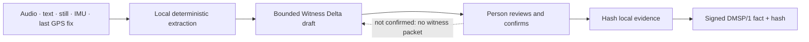

Current model slot: **`MODEL_UNAVAILABLE`**. No Whisper, sherpa-onnx or NPU delegate is bundled. `NPU` is returned only if a caller reports a delegate actually loaded.

### 2. Scarce-Slot Gate

Priority routing decides which admitted packet goes next. The gate decides whether a new observation should enter the radio at all. It runs in the confirm path, before enqueue and before fragmentation.

| Decision | Code token | When |
|---|---|---|
| ADMIT | `admit` | New fact, or a new life threat |
| DEFER | `defer` | Repeat with no new fact, or a routine update below 15% battery |
| REPLACE_PREVIOUS | `replace_previous` | A new field replaces an unsent report from the same origin |

A new life-threat fact is admitted even at low battery. The gate never marks anyone `SAFE`. Fragment counts it reports are estimates from payload size, not measured airtime. A deferred witness is not signed onto the mesh, but a compact gate-decision packet can be queued so the desk can see the real decision later.

### 3. Heard-Cut

A signed digest carries a time window, a battery bucket (`unknown`, `low`, `mid`, `high`), up to eight 32-hex origin pseudonyms and an optional held message id. Phone numbers and device names fail parsing. The phone records an origin only from a packet that already verified, never from a raw BLE address.

```text
previously heard, absent from the current window → UNHEARD
UNHEARD ≠ SAFE
UNHEARD ≠ MISSING
UNHEARD ≠ DEAD
```

No coverage map. No RSSI-as-distance. No AI. Disappearance is a connectivity observation, not a status of the person.

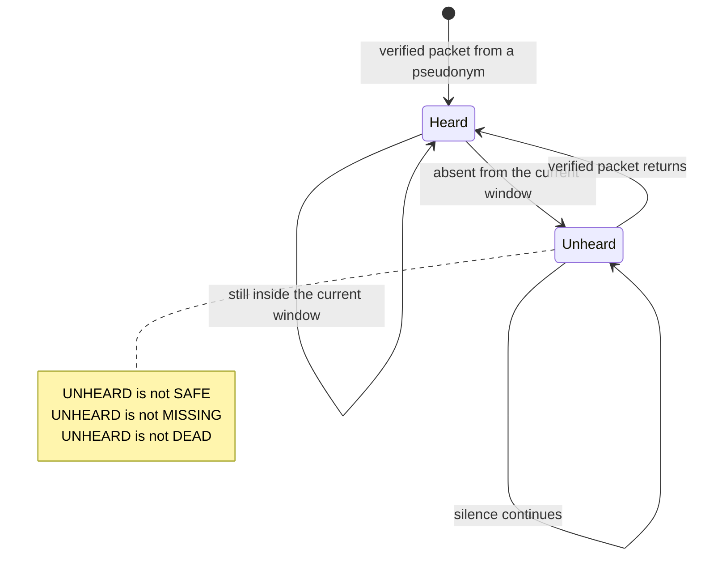

### 4. Hash-Pull

The desk stores the fact, metadata, location from the signed header and the hash. `mediaOnMesh` is false. Original bytes move only after an explicit authorized request.

| Rule | Implementation |
|---|---|
| Who may request | `admin` or `operator`, and `explicit: true`. A responder is rejected |
| Mesh cannot pull the file | A synced `evidence_request` or `evidence_response` is `operator_channel_only` |
| Clipboard is untrusted | A `command` field is rejected. Paste is hash-checked, not executed |
| Corrupt bytes | SHA-256 mismatch returns `corrupt_evidence` and is audited |
| Match | The verify route does not store the media |

On the phone, the implemented bridge is the Android share sheet (`os_share`). That is not an Office Kit transfer.

---

## Architecture

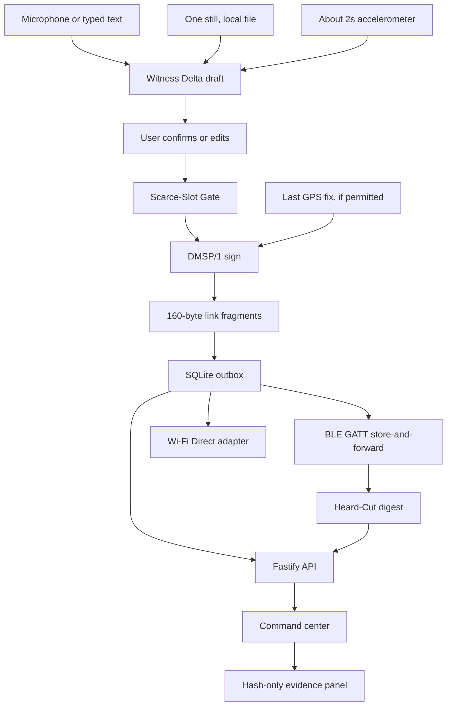

`ble` and `wifi` are implemented adapters. Neither has been executed on a phone in this environment. The Wi-Fi Aware check is a capability probe only.

### Phone first, laptop optional

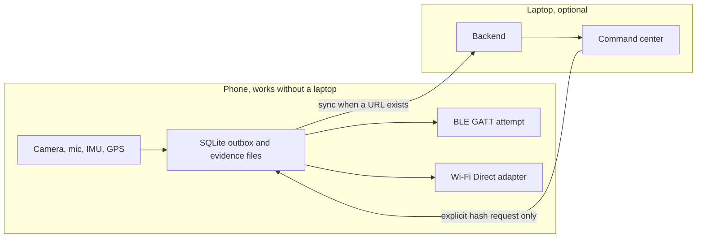

### Red Light / Green Light split

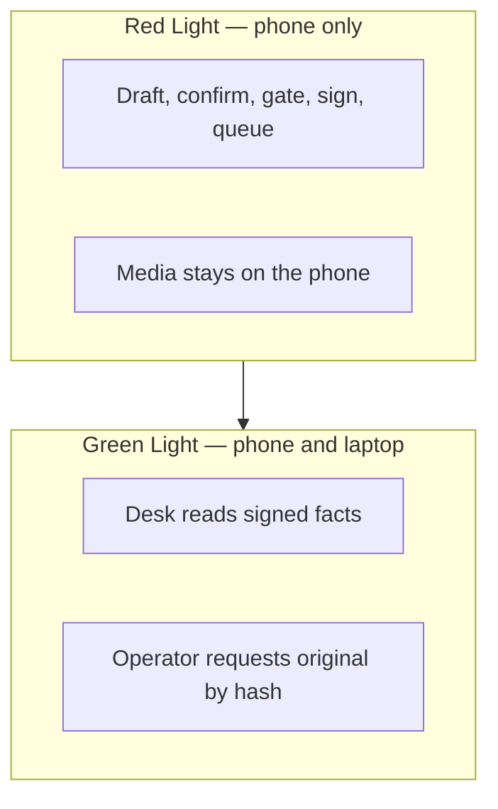

### Store-and-forward

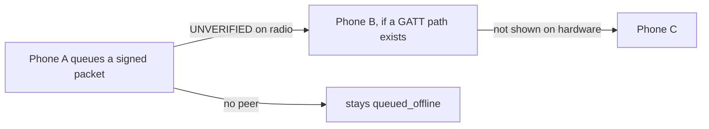

A queued packet is not a relay. A relay is not command-center receipt. Three-phone A→B→C is **PHYSICAL MULTI-HOP: UNVERIFIED**.

### Rescue is an operator action, not an inference

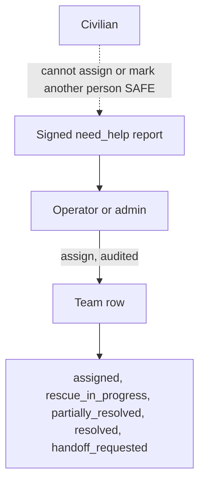

---

## DMSP/1 Protocol

Magic `DMSP`, version 1. The mutable relay header sits outside the signature so a hop can change hop fields without re-signing. A relay cannot change the signed body without failing verification.

| Outer frame | Size |
|---|---|
| hopLimit, hopCount, relay flags, frame version | 4 bytes |
| signed blob length | 2 bytes |
| signed blob | 176-byte header + payload |
| ECDSA P-256 signature, IEEE P1363 `r‖s` | 64 bytes |

- **Signed header fields:** flags, priority 0–4, payload type, message id, origin pseudonym, incident id, event time, expiry, 12-byte nonce, content sequence, optional location (`latE7`, `lonE7`, accuracy, age) and the 65-byte uncompressed public key.
- **Limits:** payload max 512 bytes. Encoded packet max 1400 bytes. Mesh text 120 characters. Default hop limit 5, hard max 8. Clock skew 2 minutes into the future. Max TTL 48 hours.
- **Flags:** location, incident, ack requested, is ack, gateway originated, simulated. Unknown flag bits are rejected. Live sync rejects the simulated flag so simulator bytes can never become live incidents.
- **Replay protection:** unique message id at the desk. The nonce is signed and length-checked. Dedup also exists in the forwarding policy.
- **Fragmentation** (`shared-protocol/src/fragment.ts`): 160-byte chunks, 13-byte header (flags, index, count, 8-byte message prefix, total length). Max 16 fragments. Reassembly times out after 8 seconds. Unit-tested.
- **GATT writer:** will not send a packet over 180 bytes as one write, because a partial write is not delivery. The multi-chunk on-device writer is **UNVERIFIED** and not claimed.

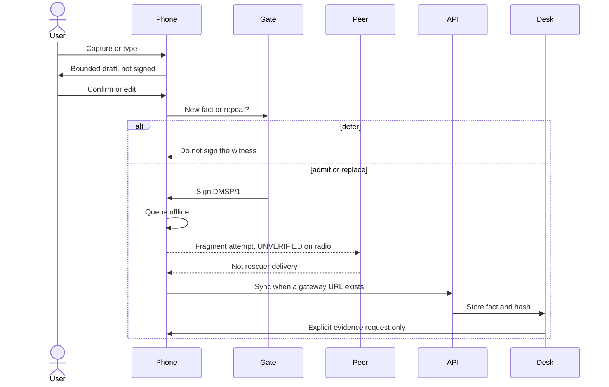

### Priority scheduling

Weighted round-robin: P0×8, P1×4, P2×2, P3×1, P4×1. Low priority still gets a slot and is never starved by the scheduler.

| Priority | Meaning |
|---|---|
| P0 | Immediate life threat, including SOS |
| P1 | Needs help |
| P2 | Evacuation |
| P3 | Routine status |
| P4 | General information |

### Delivery words stay separate

| State | Meaning |
|---|---|
| `queued_offline` | On this phone only. Rescuers have not received it |
| `relayed_to_peer` | A nearby phone accepted bytes. Not the command center |
| `delivered_to_gateway` | An upload was handed off. Receipt not confirmed |
| `received_by_command_center` | The API accepted the signed packet |
| `acknowledged_by_operator` | A person pressed mark seen. Not a rescue |
| `expired` / `rejected` | Not forwarded / not accepted |
| `lab_loopback` | Android only, after a second confirmation. Simulated. Not a radio test |

The state machine never treats relayed as acknowledged.

---

## Android App (phone first)

Package `app.disastermesh`. minSdk 26, compileSdk 35, Jetpack Compose. English, Hindi and Marathi copy. Primary actions are large buttons: need help, safe, evacuating, report, find, SOS.

| Phone piece | Role | Without a laptop |
|---|---|---|
| Camera | One still, hashed locally | Stays on the phone |
| Microphone | About 8 seconds, or platform speech if present | Failure falls back to typing |
| IMU | About 2 seconds of accelerometer tilt | Missing sample is not invented |
| GPS | Last known fix and accuracy, or manual coordinates | Report can still queue |
| SQLite | Reports, outbox, contacts, settings, heard ids | Survives process restart |
| Identity | Android Keystore when it loads. Otherwise a software key with a visible warning | Signing does not need the desk |
| Mesh engine | BLE advertise / scan / GATT attempt, Wi-Fi Direct discovery, Wi-Fi Aware probe | Errors are shown. Success is never assumed |
| Witness screen | Draft, confirm, gate, heard-cut, share sheet | Complete without Office Kit |
| 112 | Opens the dialer. The user must confirm the call | Not a mesh delivery |

SOS sends a P0 packet. It does not dial 112 until the user opens the dialer. Rescue mode on the phone requires a real responder, operator or admin login against a configured command-center URL. A civilian switch cannot grant it.

## Local Processing

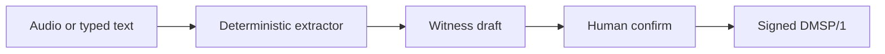

`extractReport` is a rule set for English, Hindi and Marathi. It returns confidence below 1 and a note that this is not a medical or safety determination. It does not publish an official alert and there is no government alert feed. There is no project-trained model, no bundled weights and no cloud inference on the report path. If `SpeechRecognizer` is missing, the UI says so and asks for typed text.

**The AI is not an authority.** It proposes a draft. The person confirms. The protocol carries the confirmed fact.

---

## Emergency State

States: `unknown`, `need_help`, `safe`, `evacuating`, `resolved`.

| State | Meaning |
|---|---|
| `unknown` | No confirmed self-report. The default. Not safe and not dead |
| `need_help` | The reporting person says they need help |
| `safe` | A self-report. Not proof. Another person cannot mark them safe |
| `evacuating` | A self-report that they are moving, with an optional destination |
| `resolved` | A later status. Not proof a rescue happened |

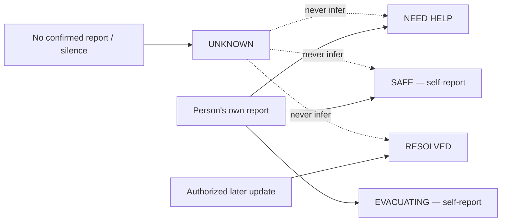

A civilian cannot assign a team or impersonate a responder. An invalid packet cannot overwrite a valid `need_help`. Another origin cannot clear `need_help` to `safe`. A stale same-origin sequence does not downgrade. Unresolvable disagreement stays `conflicting`. Silence stays `unknown`. Team statuses are `available`, `assigned`, `rescue_in_progress`, `partially_resolved`, `resolved` and `handoff_requested`. There is no `rescued` status. Assignment is an audit row, not a rescue.

## Dynamic Emergency Groups

A group is an operational cluster of reports, not a chat room and not "phones that saw each other."

Auto-grouping uses GPS only (BLE RSSI is unread). Two reports cluster only when:

- the incident type matches,
- timestamps are within 30 minutes,
- both accuracies are known and at most 100 m,
- and distance plus both accuracy radii is within 150 m.

High confidence requires both accuracies at or below 30 m. One bad or missing fix does not create a group. Splits and merges are recorded as lineage and never delete the underlying reports. Duplicate and contradiction hints are operator prompts, not automatic merges.

---

## Command Center

React, TypeScript, Vite, Tailwind. Leaflet shows stored coordinates. Tiles are an online map, not a mesh coverage layer.

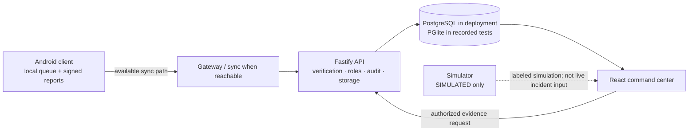

This is a logical architecture view, not evidence that physical phone-to-gateway sync was exercised.

| Page | What it shows |
|---|---|
| Overview | Counts from stored rows. An empty database is zeros, not a census |
| Map | Incidents with coordinates. Missing location stays off the map |
| Inbox | Signed reports and delivery words |
| Groups | Conservative clusters and lineage |
| Teams | Named teams. Creating one is not a rescue |
| Connectivity | Contact observations. No coverage claim |
| Unknown zones | Cells with contact and no resolved state. Not a map of missing people |
| Alerts | No official warning is generated on the phone |
| AI review | Extractor output, not persisted as an alert |
| Timeline / analytics | Stored events. Gateway delay is null when there is no sample |
| Simulator | Labeled `SIMULATED`. Never inserts a live incident |
| Edge | Witness cards, separate conflict counts, heard and unheard, hash-only evidence, gate decisions |
| Settings | Role-gated users and audit |

Roles: admin, operator, responder, alert publisher.

## Simulator

`simulator/` runs logical nodes with a seeded PRNG. `radioKind` is always `SIMULATED`.

| Scenario | Logical nodes | What the test checks |
|---|---:|---|
| `baseline-10` | 10 | Result stays labeled simulated |
| `flood-100` | 100 | Loss and duplicates |
| `partition-1000` | 1,000 | Partition then reconnect |
| `gateway-loss` | 40 | Gateway loss behavior in the model |
| `stress-10000` | 10,000 | Bounded run. Not device throughput |

Recorded simulator suite: **6 passed, 0 failed**, including the 1,000 and 10,000 node cases. This is a software model. It is not 10,000 phones, not BLE and not a latency measurement.

---

## Security and Trust Model

| Boundary | Mechanism |
|---|---|
| Origin | ECDSA P-256, SHA-256, Node `crypto` and Java `SHA256withECDSA`. No custom cipher |
| Phone key | Android Keystore preferred. Software fallback is labeled not hardware-backed |
| Relay | Can change hop fields only. Signed body failure rejects the packet |
| Replay | Unique `messageId` at the desk. Dedup cache on the forward path |
| Expiry | Future skew 2 minutes. TTL cap 48 hours. Expired packets are not forwarded |
| Simulation | `simulated` flag cannot enter live sync |
| Roles | Admin, operator, responder, alert publisher. Login failure does not reveal whether the account exists |
| Evidence | SHA-256. Operator-only explicit request. Clipboard cannot carry a command |
| Privacy of ids | 16-byte origin pseudonym. Heard-cut rejects phone numbers |

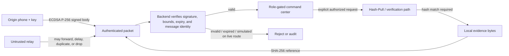

Not military-grade and not unbreakable. A stolen unlocked phone can sign as that phone. A malicious relay can drop packets, but dropping is not forging. A valid signature establishes the signing key, not the truth of a report. Threat notes: [docs/THREAT_MODEL.md](docs/THREAT_MODEL.md).

### Privacy

- Raw audio and images stay on the phone unless the user shares them.
- The mesh payload carries a hash and a short confirmed text.
- Location is optional, with accuracy, and is never inferred from RSSI.
- Heard-cut stores pseudonyms, not device names.
- Evidence retrieval is an audited operator action.
- No cloud model on the emergency path.
- Local demo HTTP and PGlite are not a production deployment. Use TLS and PostgreSQL on any shared network.

---

## Why This Fits iQOO

The event loaner is an iQOO flagship (the 2026 series names the iQOO 15). Official store specifications, not measurements from this project, include Snapdragon 8 Elite Gen 5, a triple 50 MP rear camera with a Sony 3x periscope, a 32 MP front camera, a 6.85-inch 3168×1440 AMOLED, OriginOS 6 and a 7000 mAh silicon-anode battery with 100 W wired charging. Sources: [iQOO 15 store page](https://shop.iqoo.com/in/product/2067) and the [official guide](https://iqoo.reskilll.com/guide).

None of these hardware numbers were measured by DisasterMesh. They are why a phone-only field client is a serious target.

| iQOO capability | DisasterMesh usage | Verification |
|---|---|---|
| Camera | One witness still, hashed locally, never put on the mesh | Code present. Capture **UNVERIFIED** |
| Microphone | Short local recording, optional platform speech | Code present. Capture **UNVERIFIED** |
| IMU | About 2 seconds of tilt, not a location | Code present. Sensor **UNVERIFIED** |
| GPS | Fix, accuracy and time on the signed header, or manual place | Last-known API present. Device fix **UNVERIFIED** |
| Local compute | Draft, gate, sign, queue and fragment without a server | Software-tested. Phone run **UNVERIFIED** |
| Snapdragon NPU | Intended acceleration target if a delegate loads | **`MODEL_UNAVAILABLE`**. Not claimed |
| Battery | Relay policy at 15% and 8%. Scarce-slot defer for routine updates | Policy tested in software |
| Office Kit | Phone/laptop split is architectural | SDK **`UNAVAILABLE`**. OS share sheet only |

Nothing here is claimed as exclusive to iQOO. The same Android APIs are the implementation. iQOO is the event device and the endurance target.

## Office Kit Integration

The official guide describes Office Kit as the phone–laptop bridge: screen mirror, shared clipboard, file transfer and remote control. This repository does not contain an Office Kit SDK.

| Capability | What DisasterMesh would use it for | Status |
|---|---|---|
| Screen mirror | Show the phone Witness screen on a laptop during Green Light | Device feature, not called by this app. **UNVERIFIED** |
| Remote control | Not used. No remote command may bypass operator authorization | Not implemented by design |
| File transfer | Move original evidence after an explicit request, then verify the hash | Not implemented. Phone uses `ACTION_SEND` |
| Clipboard | Desk paste is an untrusted byte source for hash check only | Desk paste implemented. Office Kit clipboard is not |

`officeKitStatus` returns `UNAVAILABLE` / `os_share` when no SDK is present.

---

## iQOO Hackathon 2026 — Judging Alignment

Checked against the published guide: [iqoo.reskilll.com/guide](https://iqoo.reskilll.com/guide).

| Criterion | Weight | Evidence in this repo | Why it scores | Verification |
|---|---:|---|---|---|
| **End product quality** | 30% | Phone UI, signed outbox, DMSP/1, edge drafts, command center, API, simulator, setup docs | A person can draft, confirm, queue and later sync a signed fact, and the system never mislabels a queue as a rescue | Software build and tests. Phone install not yet done |
| **Novelty and impact** | 20% | Gate before fragmentation, heard-cut that refuses to infer safety, hash instead of raw media, conflicts kept apart, conservative groups | The scarce resource is information, not only packet order. Silence is not a status | Design is in code. Field impact not measured |
| **Creative phone use** | 15% | Camera, microphone, IMU, GPS, local queue, on-device draft | The phone is the capture, signing and store-and-forward node, not a remote for a website | Features exist in the app. Hardware run pending |
| **Technical depth** | 15% | Signed codec, hop header, dedup, TTL, priority scheduler, fragments, reassembly, groups, roles, audit | One protocol carries status, witness, heard-cut and gate decisions | Protocol and API tests pass. Radio path **UNVERIFIED** |
| **Office Kit usage** | 10% | Phone/laptop split by design. Android share sheet as the bridge | Architecture is ready for Office Kit. SDK itself is not integrated | **`UNAVAILABLE`**. Not tested |
| **Demo and presentation** | 10% | 4–5 minute labeled script below | Show the draft, the defer, the hash and the unverified radio openly | Script is documentation |

This table is evidence, not a score.

**Best-fit tracks:** Community App and Open Innovation. Confirm the track on the event dashboard.

---

## Verification Snapshot

| Capability | Status | Qualification |
|---|---|---|
| Offline-first phone workflow | ✅ Implemented in software | Draft, confirm, sign and queue locally. Phone run not verified |
| Store-and-forward | ✅ Implemented in software | Queue and forwarding logic exist. Physical radio delivery unverified |
| Signed DMSP/1 packets | ✅ Software-tested | ECDSA P-256 path. Signatures do not prove report truth |
| Edge layer | ✅ Implemented in software | Witness Delta, Scarce-Slot Gate, Heard-Cut, Hash-Pull routes and UI |
| Dynamic emergency groups | ✅ Implemented in software | Conservative GPS/context grouping and lineage. Not field-validated |
| Command center | ✅ Implemented | React desk and backend. Recorded tests use PGlite |
| Android APK build | ⚠️ Compile succeeded | Not installed on a device |
| Physical multi-hop | ⚠️ **UNVERIFIED** | No physical A→B→C relay result |
| Local NPU model | ⚠️ **`MODEL_UNAVAILABLE`** | No model or delegate loaded |
| Office Kit SDK | ⚠️ **`UNAVAILABLE`** | OS share sheet only |

## Testing

Recorded on **2026-09-30**: `npm test` reported 0 failures. Android `:protocol:test` reported 0 failures. `:app:assembleDebug` exited 0.

| Component | Tests | Result | Status |
|---|---|---|---|
| Protocol, including edge | 15 in `protocol.test.ts`, 6 in `edge.test.ts` | 21 passed | Software |
| Backend API and edge | 6 + 2 | 8 passed (PGlite) | Software. PostgreSQL not started |
| Simulator | 6 | 6 passed, incl. 1,000 and 10,000 nodes | **SIMULATED** |
| Command center | 2 overview + 1 edge | 3 passed | Component tests |
| Android JVM | `DmspTest` 6, `EdgeTest` 4 | 10 passed | JVM, not a device |
| Debug APK | `:app:assembleDebug` exit 0 | 11,031,792 bytes | Compile only. Not installed |

GitHub Actions workflows exist (`.github/workflows/ci.yml`, `.github/workflows/android-apk.yml`). No claim is made that they have run green on GitHub.

### Physical validation plan

Follow [docs/PHYSICAL_DEVICE_TEST_PLAN.md](docs/PHYSICAL_DEVICE_TEST_PLAN.md). Every line stays `NOT RUN` until someone watches it happen.

| Test | Status |
|---|---|
| APK install | **UNVERIFIED** |
| Camera, microphone, IMU, GPS, speech | **UNVERIFIED** |
| NPU inference | **UNAVAILABLE** |
| BLE advertise, scan, connect, GATT write | **UNVERIFIED** |
| Two-phone signed exchange | **NOT RUN** |
| Three-phone A→B→C with B relaying | **UNVERIFIED** |
| Bluetooth interruption and recovery | **NOT RUN** |
| Wi-Fi Direct transfer | **UNVERIFIED** |
| Office Kit mirror, clipboard, file transfer | **UNAVAILABLE** |
| Share-sheet transfer | Code present. **UNVERIFIED** |

No latency, packet-success rate, radio fragment count, battery drain or transfer time has been measured, and none is published.

## Data and Model Provenance

No project-specific model training is included. There is no dataset, no train/validation/test split, no weights file and no accuracy number.

| Piece | What it is |
|---|---|
| Extractor | Hand-written rules. English, Hindi, Marathi word lists. Not trained |
| Witness draft | Same extractor, plus waterline words and a confirmation gate |
| Speech | Platform `SpeechRecognizer` if the device has one. Not bundled |
| Vision | Not included |
| NPU delegate | Not included. Status probe only |
| Simulator | Seeded logical nodes. Not field data |

## Performance and Scale

Only numbers that exist in code or in a recorded run:

| Figure | Source | Not |
|---|---|---|
| 512-byte payload, 1400-byte packet, 160-byte chunks, 13-byte fragment header | Protocol constants | Measured airtime |
| 120-character mesh text | Protocol constant | A UX study |
| 8-second reassembly timeout | `Reassembler` default | A radio measurement |
| 150 m grouping rule, 100 m accuracy cap, 30-minute window | Grouping policy | A field accuracy study |
| 10 / 100 / 1,000 / 10,000 logical nodes | Simulator scenarios and tests | Physical phones |
| 11,031,792-byte debug APK | Recorded compile | An installed binary |

---

## Recommended 4–5 Minute Demo

Open with: *prototype, not a certified emergency service, no rescue guaranteed, physical multi-hop unverified.*

| Time | Step | Label |
|---|---|---|
| 0:00–0:40 | Sign in to the desk. Open Edge. Show empty counts and `UNHEARD ≠ SAFE`. Point at `MODEL_UNAVAILABLE` and Office Kit `UNAVAILABLE` | Software verified. Zeros are stored rows |
| 0:40–1:30 | On a phone with a matching APK, open Witness. Type `बाढ़ में तीन लोग फंसे हैं, पानी दरवाजे तक`. Make a draft. Do not confirm yet | Sensors unverified. Sentence is an extractor fixture |
| 1:30–2:20 | Confirm. The line says *queued offline*, not delivered. Confirm the same sentence again: `defer` / `no_new_fact`. Change water to chest level: admit or replace. A life threat is never deferred | Gate rules software verified |
| 2:20–3:10 | Heard-cut only if a second phone has exchanged a verified packet. Otherwise say clearly it was not physically shown | Rule software verified. Radio unverified |
| 3:10–4:00 | After a signed witness sync, show the hash and the absence of image bytes. Request the original. Paste wrong text to show `corrupt_evidence` | API path software verified |
| 4:00–4:40 | Close on the sentence, the slot and the cut. The simulator is not the radio | Simulator stays labeled `SIMULATED` |

Do not say "delivered to rescuer" unless the delivery word is `received_by_command_center` or `acknowledged_by_operator`, and then say what those words mean.

---

## Quick Start

Requires Node.js 20 or newer. Android builds need JDK 17 and Android SDK 35.

```bash
cp .env.example .env
npm ci
export DM_PGLITE_PATH="$PWD/data/pglite"
SEED_USE_DEV_DEFAULTS=1 DM_DEV=1 DM_ALLOW_PGLITE=1 npm run seed
DM_DEV=1 DM_ALLOW_PGLITE=1 npm run dev:api
npm run dev:web
```

Command center: `http://127.0.0.1:5173`. Use the same `DM_PGLITE_PATH` for seed and API. Without it, PGlite is in-memory and the seed does not reach the server.

Local demo accounts exist only with `SEED_USE_DEV_DEFAULTS=1`. **Never use on a shared network.**

| Role | Login |
|---|---|
| Admin | `admin@example.invalid` / `dev-admin-pass` |
| Operator | `operator@example.invalid` / `dev-operator-pass` |
| Responder | `responder@example.invalid` / `dev-responder-pass` |
| Publisher | `publisher@example.invalid` / `dev-publisher-pass` |

**Tests and simulator**

```bash
npm test
npm run simulate -- list
npm run simulate -- run --scenario baseline-10 --seed 42 --out /tmp/baseline.json
```

The output JSON says `radioKind: SIMULATED`.

**Android**

```bash
cd android
export JAVA_HOME=/path/to/jdk-17
export ANDROID_HOME=/path/to/android-sdk
gradle :protocol:test :app:assembleDebug
adb install -r app/build/outputs/apk/debug/app-debug.apk
```

The recorded build used Gradle 8.9 directly. PostgreSQL path (untested in the build environment): [docker-compose.yml](docker-compose.yml).

## Project Layout

```text
android/            Kotlin app, Compose UI, GATT and Wi-Fi Direct adapters, JVM protocol
shared-protocol/    DMSP/1 codec, edge rules, grouping, extractor, fragments
backend/            Fastify API, PostgreSQL or local PGlite, edge evidence routes
command-center/     React desk, including /edge
simulator/          Logical nodes, always SIMULATED
docs/               Packet format, threat model, device plan, edge report, compliance
scripts/            setup.sh, package.sh
tests/              Physical-result template. Never filled from the simulator
artifacts/          Intended APK drop
```

## Known Limitations

- Physical multi-hop, BLE, Wi-Fi Direct and Wi-Fi Aware transfer are unverified. Compiling a GATT writer is not a radio test.
- The on-device multi-chunk writer is not claimed. Packets over 180 bytes are not sent as one write and not marked relayed.
- No NPU model is loaded. Office Kit is unavailable.
- `docs/PACKET_FORMAT.md` mentions a CRC trailer that `fragment.ts` does not write. The code is the contract.
- Docker Compose / PostgreSQL was not started. Backend tests used PGlite.
- The scale simulator is not a signed-packet mesh and not a phone throughput test.
- OEM battery managers can kill scans. Not measured.
- Some mesh errors are English even when the UI is Hindi or Marathi.
- Responder navigation opens an installed map app. This app does not draw the route.
- The demo JWT is a bearer token and local HTTP is a lab choice.

## Roadmap

| State | Item |
|---|---|
| ✅ In this repo | DMSP/1, phone UI, outbox, edge draft / gate / heard / hash, desk, simulator, software tests |
| 🔜 Next (device proof) | Install the APK. Run camera, mic, IMU, GPS, speech on an iQOO 15 |
| 🔜 Next (radio proof) | Two-phone signed exchange. Three-phone A→B→C with B as the only relay. BLE interruption and recovery |
| 🧭 Planned | Office Kit SDK. A local model that actually loads. NPU delegate. Align the CRC trailer between code and docs |

## Originality and Eligibility

Hackathon eligibility and prior-work disclosure are documented in [docs/HACKATHON_COMPLIANCE.md](docs/HACKATHON_COMPLIANCE.md).

## Safety Boundary

DisasterMesh is not a certified emergency service and does not guarantee delivery, rescue or safety. `SAFE` is self-reported. Silence is `UNKNOWN`. `UNHEARD` is not safe, missing or dead. A valid signature establishes the signing key, not the truth of a report.

## References

- [iQOO Hackathon 2026 guide and rules](https://iqoo.reskilll.com/guide)
- [iQOO Hackathon terms](https://iqoo.reskilll.com/terms)
- [Registration](https://iqoo.reskilll.com/)
- [iQOO 15, India store](https://shop.iqoo.com/in/product/2067)
- [iQOO 15 product page](https://www.iqoo.com/en/products/iQOO-15)

Repository: [github.com/harshtakalkar037-boop/disastermesh](https://github.com/harshtakalkar037-boop/disastermesh)

## License

Apache-2.0. Third-party components are listed in `NOTICE`. Bluetooth Mesh, Wi-Fi Direct, Wi-Fi Aware and Nearby are platform technologies. This project does not claim a Bluetooth SIG assignment or a government alert integration.
