# DisasterMesh

## When the network dies, the phones become the network.

**DisasterMesh is a phone-first, offline-oriented disaster reporting prototype.** A witness creates a bounded local observation, confirms it, and signs a compact DMSP/1 packet. The phone queues that packet for a possible peer or gateway; forwarding is store-and-forward, not a delivery guarantee. Structured facts and evidence hashes travel in the protocol, while original media remains local until an explicit authorized request.

The system combines an Android client, an application-layer mesh path, a backend and command-center view, conservative emergency grouping, and an edge layer for witness drafts, scarce-slot admission, connectivity observations, and hash-based evidence retrieval. **Physical phone-to-phone multi-hop, NPU inference, and Office Kit integration are not verified/available in this tree.**

> **Safety boundary:** This is not a certified emergency service. It does not guarantee delivery, rescue, or safety. `SAFE` is self-reported; silence is `UNKNOWN`; `UNHEARD` is not safe, missing, or dead. A valid signature establishes the signing key, not the truth of a report.

> **Hackathon eligibility:** The published iQOO Hackathon 2026 guide says original work must be written during the event window and a completed app must not be shipped in. Do not submit this repository as in-event work unless organisers allow prior work. See [docs/HACKATHON_COMPLIANCE.md](docs/HACKATHON_COMPLIANCE.md).

Repository: [github.com/harshtakalkar037-boop/disastermesh](https://github.com/harshtakalkar037-boop/disastermesh)

### Capability snapshot

| Capability | Status | What that status means |
|---|---|---|
| Offline-first phone workflow | ✅ Implemented in software | Draft, confirm, sign, and queue locally; device run not verified |
| Store-and-forward | ✅ Implemented in software | Queue and forwarding logic exist; physical radio delivery unverified |
| Signed DMSP/1 packets | ✅ Implemented and software-tested | ECDSA P-256 signed packet path; signature does not prove report truth |
| Edge layer | ✅ Implemented in software | Witness Delta, Scarce-Slot Gate, Heard-Cut, Hash-Pull routes/UI |
| Dynamic emergency groups | ✅ Implemented in software | Conservative GPS/context grouping and lineage; not field-validated |
| Command center | ✅ Implemented | React desk and backend; demo tests use PGlite |
| Android APK build | ⚠️ Recorded compile succeeded | APK was not installed; recorded bytes are not present in this tree |
| Physical multi-hop | ⚠️ UNVERIFIED | No physical A→B→C relay result |
| Local NPU model | ⚠️ `MODEL_UNAVAILABLE` | No model/delegate is currently loaded or bundled |
| Office Kit SDK | ⚠️ `UNAVAILABLE` | OS share-sheet path only; no Office Kit integration |


### System architecture

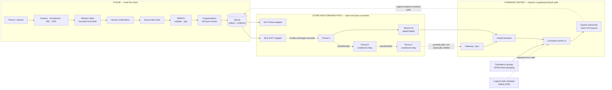

> The protocol fragmentation/reassembly path is software-tested. `fragment.ts` does **not** append the CRC trailer mentioned in `docs/PACKET_FORMAT.md`. Phone A→B→C, gateway recovery over radio, and evidence transfer to a device remain **UNVERIFIED**.

## The Problem

Disaster communication is brittle when it assumes continuous cellular service, a reachable server, ample bandwidth, or a stable picture of who is connected. DisasterMesh is designed around queued reports and partial, changing connectivity—but its radio behavior still needs physical validation.

| Failure condition | Conventional approach | DisasterMesh response |
|---|---|---|
| Internet unavailable | Request fails or waits for a server | Local SQLite outbox; report can remain `queued_offline` |
| Cellular infrastructure down | No server path | BLE GATT / Wi-Fi Direct adapters and store-and-forward logic exist; physical relay is **UNVERIFIED** |
| Limited radio capacity | Send every update | Scarce-Slot Gate admits, defers, or replaces eligible unsent information before enqueue |
| Duplicate reports | Repeated traffic | Message-id deduplication and repeat/no-new-fact defer rules |
| Conflicting reports | Last update may overwrite earlier information | Signed conflicting observations are kept distinct; no averaging of conflicting counts |
| Large media | Upload the entire file | Compact evidence hash in the report; explicit operator request for original evidence |
| Connectivity disappears | Treat missing contact as an error or status | Heard-Cut records an observation; `UNHEARD` does not mean `SAFE`, `MISSING`, or `DEAD` |
| Battery is low | Continue the same relay policy | Software policy: below 8% no relay; below 15% relay only P0/P1, with life-threat admission preserved |
| Relay is untrusted | Trust the transport path | Signed body prevents undetected report modification; relay can still drop packets |

## The Core Idea

### Conventional emergency path

```text
Person → Internet → Cloud server → Responder
```

### DisasterMesh path

```mermaid
flowchart LR
  person[Person] --> observation[Local observation]
  observation --> human[Human confirmation]
  human --> admission[Scarce-slot admission]
  admission --> signed[Signed DMSP/1 packet]
  signed --> fragment[Fragmentation]
  fragment -. "radio path: UNVERIFIED" .-> peer[Phone-to-phone relay]
  peer --> reassembly[Reassembly and verification]
  reassembly --> state[Emergency state / group view]
  state --> gateway[Gateway recovery, when available]
  gateway --> desk[Command center]
```

The differentiator is not simply an SOS button. The phone decides what can be safely expressed as a bounded, user-confirmed fact; admission logic limits what enters a constrained queue; the protocol preserves origin authentication and expiry metadata; and the command center can later display synchronized reports without treating silence as a status.

## What it is, and what it is not

| This is | This is not |
| --- | --- |
| A phone-first store-and-forward client plus a desk that accepts signed packets | A rescue service, a coverage map, or a delivery guarantee |
| One protocol, DMSP/1, extended with edge payload types | A second protocol, a chatbot, or a cloud model on the emergency path |
| Application-layer forwarding over BLE GATT, with a separate Wi-Fi Direct adapter | Bluetooth Mesh, and not “Wi-Fi Direct is a mesh” |
| A deterministic English / Hindi / Marathi extractor, with an explicit model slot | A loaded NPU model. Current inference status is `MODEL_UNAVAILABLE` |
| Software tests, a recorded debug compile, and a labeled simulator | A measured two-phone or three-phone radio result |

## The difference

A normal emergency app assumes a path that is often the first thing to fail:

```text
Person → Internet → Server → Responder
```

DisasterMesh assumes that path is gone, and that the radio which remains is small, lossy, and not allowed to invent facts:

```text
Person
  → local observation
  → user confirmation
  → scarce-slot admission
  → signed DMSP/1 packet
  → fragmentation
  → phone-to-phone store-and-forward
  → reassembly and signature check
  → gateway recovery, if a path exists
  → command center
  → hash-pull of the original, only after an explicit operator request
```

The phone is the product. The desk is a later view of signed records. If the laptop disappears, the phone can still draft, confirm, gate, sign, queue, and keep the media.

## Why the architecture matters

The hard problem is not “send an SOS.” It is how phones exchange a trustworthy, compact, prioritized fact when:

| Constraint | What the code does | What it refuses to do |
| --- | --- | --- |
| No infrastructure | SQLite outbox, `queued_offline` until a real peer or gateway accepts | Call a queued report “delivered to a rescuer” |
| Small radio | 512-byte payload cap, 160-byte link chunks, scarce-slot gate before enqueue | Put raw audio or images on the mesh |
| Duplicates | Message-id dedup; a repeat with no new fact is `defer` | Spend fragments restating the same fact |
| Reordering and conflict | Same-origin stale sequence does not downgrade; two signed counts stay separate | Average conflicting people counts, or let the last packet win |
| Silence | `UNKNOWN` and `UNHEARD` | Infer `SAFE`, `MISSING`, or `DEAD` |
| Large evidence | SHA-256 of the local bytes, hash-only desk | Treat clipboard paste as a command |
| Low battery | Below 8% no relay; below 15% relay only P0/P1 | Defer a confirmed life threat to save bandwidth |
| Untrusted relay | Hop fields sit outside the signature; the body is signed | Trust a relay to rewrite the report |

## The Edge Intelligence Layer

The edge layer sits on the existing protocol. It does not replace signing, nonce, TTL, priority, dedup, fragmentation, or replay protection. Payload codes 12–16 are `witness_delta`, `heard_digest`, `evidence_request`, `evidence_response`, and `scarce_slot_decision`.

Phone path:

```text
CAPTURE → AI DRAFT → USER CONFIRM → ADMITTED / DEFERRED → SIGNED → QUEUED / RELAYED
```

`RELAYED` is a nearby phone, not a rescuer. That last step is **UNVERIFIED** on hardware.

### 1. Witness Delta

Sensors and text become a bounded draft. The user confirms or edits it before it is a signed message.

The draft may carry incident type, self-claimed state, people count, language (`en`, `hi`, `mr`), waterline band, optional tilt, confidence strictly below 1, an evidence hash, and an inference status: `NPU`, `CPU_FALLBACK`, or `MODEL_UNAVAILABLE`. Empty text, or an `NPU` label with no named delegate, returns `manual_form_required`. A flood phrase plus a `no_water_cue` marks self-conflict and caps confidence. `official`, assignment, and team id are rejected. The model cannot declare another person safe, emit an official warning, or assign a rescue.

The phone UI can try about 8 seconds of audio, one still, a 2-second accelerometer window, and the last GPS fix. A failed sensor is labeled unavailable. No file, tilt, or transcript is invented. Confirmation hashes the local bytes and puts only the hash in the packet.

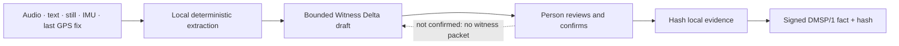

Current model slot: **`MODEL_UNAVAILABLE`**. No Whisper, sherpa-onnx, or NPU delegate is bundled. `NPU` is returned only if a caller reports that a delegate actually loaded. Device speech, if the platform recognizer returns text, is not labeled `NPU`.

### 2. Scarce-Slot Gate

Priority routing decides which already-admitted packet goes next. The gate decides whether a new observation should enter the radio at all. It runs in the confirm path, before enqueue and before fragmentation.

| Decision | Code token | When |
| --- | --- | --- |
| ADMIT | `admit` | New fact, or a new life threat |
| DEFER | `defer` | Repeat with no new fact, or a routine update below 15% battery |
| REPLACE_PREVIOUS | `replace_previous` | A new field replaces an unsent report from the same origin |

A new life-threat fact is admitted even at low battery. The gate does not mark anyone `SAFE` and does not replace the priority scheduler. Fragment counts it reports are estimates from payload size, not measured airtime. A deferred witness is not signed onto the mesh. A compact gate-decision packet can still be queued so the desk can see the real decision later.

### 3. Heard-Cut

A signed digest carries a time window, an already-permitted battery bucket (`unknown`, `low`, `mid`, `high`), up to eight 32-hex origin pseudonyms, and an optional held message id. Phone numbers and device names fail parsing. The phone records an origin only from a packet that already verified. It does not record a BLE address as a person.

```text
previously heard, absent from the current window → UNHEARD
UNHEARD ≠ SAFE
UNHEARD ≠ MISSING
UNHEARD ≠ DEAD
```

There is no coverage map and no RSSI-as-distance. No AI is used. Disappearance is a connectivity observation, not a status of the person.

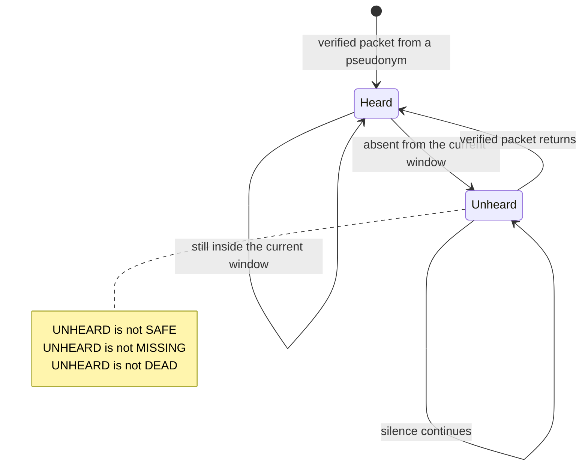

### 4. Hash-Pull

The desk stores the fact, metadata, location from the signed header, and the hash. `mediaOnMesh` is false. Original bytes move only after an explicit authorized request.

| Rule | Implementation |
| --- | --- |
| Who may request | `admin` or `operator`, and `explicit: true`. A responder is rejected. |
| Mesh cannot pull the file | A synced `evidence_request` or `evidence_response` is `operator_channel_only` |
| Clipboard is untrusted | A `command` field is rejected. Paste is hash-checked, not executed |
| Corrupt bytes | SHA-256 mismatch is `corrupt_evidence` and audited |
| Match | The verify route does not store the media |

On the phone, the implemented bridge is the Android share sheet (`os_share`). That is not an Office Kit transfer.

## Architecture

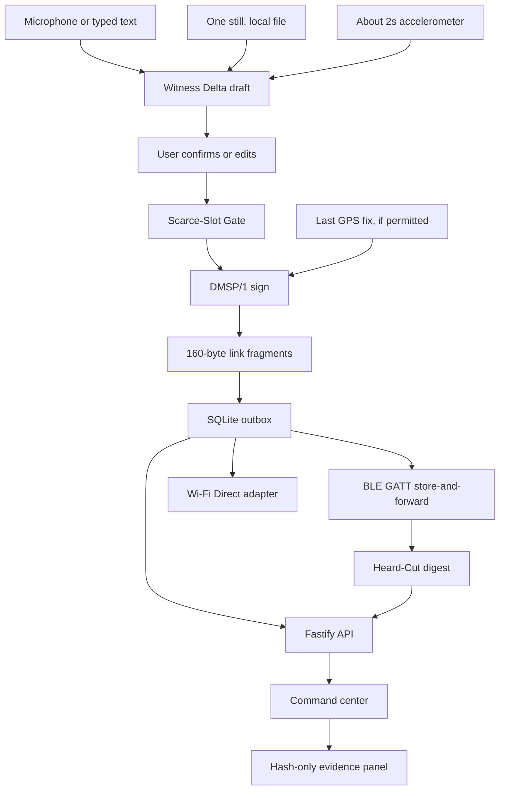

`ble` and `wifi` are implemented adapters. Neither has been executed on a phone in this environment. The Wi-Fi Aware check is a capability probe only.

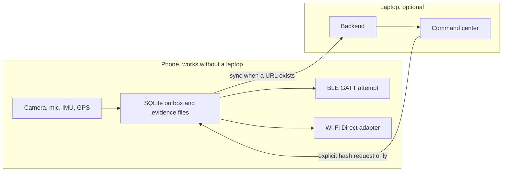

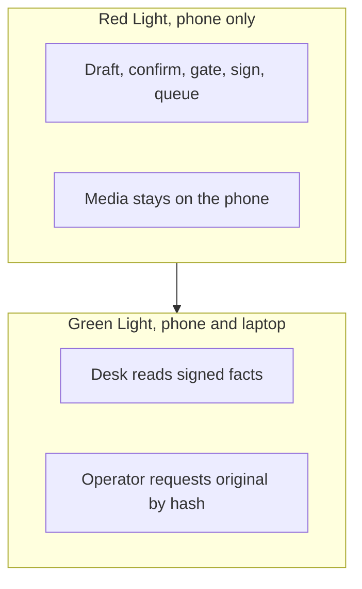

Store-and-forward, as implemented:

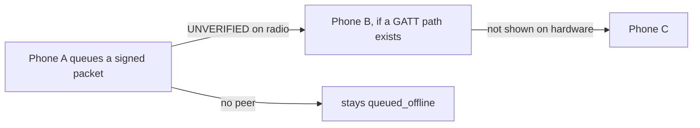

A queued packet is not a relay. A relay is not command-center receipt. Three-phone A→B→C is **PHYSICAL MULTI-HOP: UNVERIFIED**.

Rescue is an operator action, not an inference:

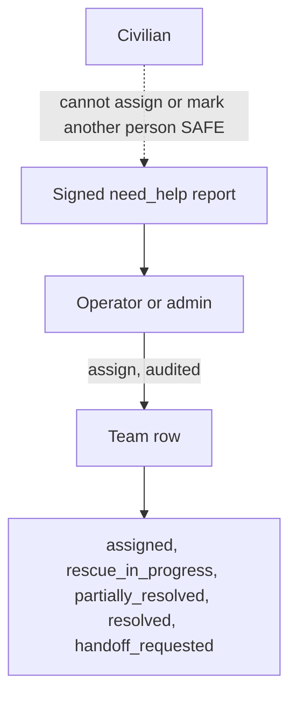

## DMSP/1

Magic `DMSP`, version 1. The mutable relay header is outside the signature so a hop can change hop fields without resigning. A relay cannot change the signed body without failing verification.

| Outer frame | Size |
| --- | --- |
| hopLimit, hopCount, relay flags, frame version | 4 bytes |
| signed blob length | 2 bytes |
| signed blob | 176-byte header + payload |
| ECDSA P-256 signature, IEEE P1363 `r‖s` | 64 bytes |

Signed header fields include flags, priority 0–4, payload type, message id, origin pseudonym, incident id, event time, expiry, 12-byte nonce, content sequence, optional location (`latE7`, `lonE7`, accuracy, age), and the 65-byte uncompressed public key. Payload maximum is 512 bytes. Encoded packet maximum is 1400 bytes. Mesh text is 120 characters. Default hop limit is 5. Hard maximum is 8. Clock skew is 2 minutes in the future. Maximum TTL is 48 hours.

Flags include location, incident, ack requested, is ack, gateway originated, and simulated. Unknown flag bits are rejected. Live sync rejects the simulated flag so simulator bytes cannot become live incidents.

Replay protection at the desk is message-id uniqueness. The nonce is signed and length-checked; it is not a separate replay cache. Dedup also exists in the forwarding policy.

Link fragmentation, in `shared-protocol/src/fragment.ts`, splits a packet into 160-byte chunks with a 13-byte header: flags, index, count, 8-byte message prefix, total length. Count is capped at 16. Reassembly times out after 8 seconds. That path is unit-tested. It does **not** append the CRC trailer described in [docs/PACKET_FORMAT.md](docs/PACKET_FORMAT.md). Treat the code as the contract.

The Android GATT writer will not send a packet larger than 180 bytes as one write, because a partial write is not delivery. The on-device multi-chunk writer is **UNVERIFIED** and is not claimed to have succeeded. A GATT write status is a peer write response, not command-center delivery.

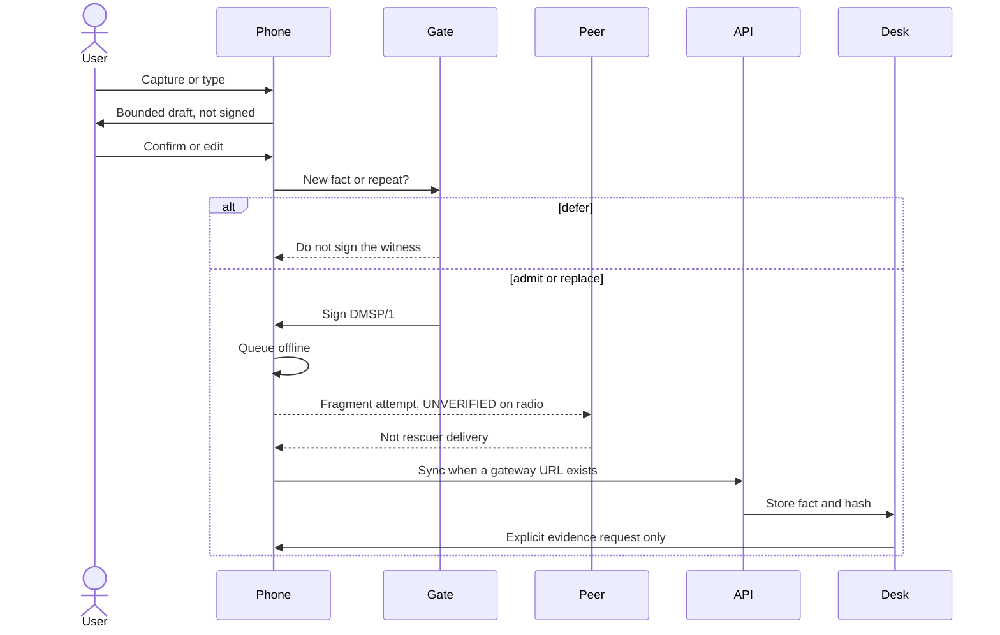

Priority is weighted round-robin: P0×8, P1×4, P2×2, P3×1, P4×1. Low priority still gets a slot. It is not dropped by the scheduler.

| Priority | Meaning |
| --- | --- |
| P0 | Immediate life threat, including SOS |
| P1 | Needs help |
| P2 | Evacuation |
| P3 | Routine status |
| P4 | General information |

Delivery words stay separate:

| State | Meaning |
| --- | --- |
| `queued_offline` | On this phone only. Rescuers have not received it. |
| `relayed_to_peer` | A nearby phone accepted bytes. Not the command center. |
| `delivered_to_gateway` | An upload was handed off. Receipt is not confirmed. |
| `received_by_command_center` | The API accepted the signed packet. |
| `acknowledged_by_operator` | A person pressed mark seen. Not a rescue. |
| `expired` / `rejected` | Not forwarded / not accepted. |
| `lab_loopback` | Android only, after a second confirmation. Simulated. Not a radio test. |

The state machine does not treat relayed as acknowledged.

## Android, phone first

Package `app.disastermesh`. minSdk 26. compileSdk 35. Jetpack Compose. English, Hindi, and Marathi copy. Primary actions are large buttons: need help, safe, evacuating, report, find, SOS.

| Phone piece | Role | Without a laptop |
| --- | --- | --- |
| Camera | One still, hashed locally | Stays on the phone |
| Microphone | About 8 seconds, or platform speech if present | Failure falls back to typing |
| IMU | About 2 seconds of accelerometer tilt | Missing sample is not invented |
| GPS | Last known fix and accuracy, or manual coordinates | A report can still queue |
| SQLite | Reports, outbox, contacts, settings, heard ids | Survives process restart |
| Identity | Android Keystore when it loads; otherwise a software key in app-private files, with a visible warning | Signing does not need the desk |
| Mesh engine | BLE advertise/scan/GATT attempt, Wi-Fi Direct discovery, Wi-Fi Aware probe | Errors are shown. Success is not assumed |
| Witness screen | Draft, confirm, gate, heard-cut, share sheet | Complete without Office Kit |
| 112 | Opens the dialer. The user must confirm the call | Not a mesh delivery |

SOS sends a P0 packet. It does not dial 112 until the user opens the dialer. Rescue mode on the phone requires a real responder, operator, or admin login against a configured command-center URL. A civilian switch cannot grant it. The token is stored with the Keystore encrypt path when that path works.

Red Light, phone only, still includes Witness Delta, local draft and confirm, the gate, Heard-Cut, the evidence hash, and the offline queue. That is the implemented product split. It has not been run on an iQOO device.

## Local processing

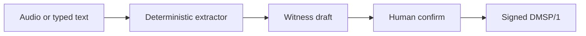

`extractReport` is a rule set for English, Hindi, and Marathi. It returns a confidence below 1 and a note that this is not a medical or safety determination. It does not publish an official alert. There is no SACHET or other government feed. `UnconfiguredOfficialFeed` is the absent-feed state.

There is no project-trained model, no bundled weights, and no cloud inference on the report path. Image understanding is unavailable. If `SpeechRecognizer` is missing, the UI says so and asks for typed text.

The AI is not an authority. It proposes a draft. The person confirms. The protocol carries the confirmed fact.

## Why This Fits iQOO

The loaner at the event is an iQOO flagship. The 2026 series names the iQOO 15. Official store specifications, not measurements from this project, include Snapdragon 8 Elite Gen 5, Supercomputing Chip Q3, a triple 50 MP rear camera with a Sony 3x periscope and a 32 MP front camera, a 6.85-inch 3168×1440 AMOLED, OriginOS 6, and a 7000 mAh silicon-anode battery with 100 W wired and 40 W wireless charging. Sources: [iQOO 15 store page](https://shop.iqoo.com/in/product/2067) and the [official guide](https://iqoo.reskilll.com/guide).

None of those hardware numbers were measured by DisasterMesh. They are why a phone-only field client is a serious target, not a claim that this build used them.

| iQOO capability | DisasterMesh usage | Verification |
| --- | --- | --- |
| Camera | One witness still, hashed locally, not put on the mesh | Code present. Camera capture **UNVERIFIED** |
| Microphone | Short local recording; optional platform speech | Code present. Capture **UNVERIFIED** |
| IMU | About 2 seconds of tilt, not a location | Code present. Sensor **UNVERIFIED** |
| GPS | Fix, accuracy, and time on the signed header, or manual place | Last-known API present. Device fix **UNVERIFIED** |
| Local compute | Draft, gate, sign, queue, and fragment without a server | Software-tested. Phone run **UNVERIFIED** |
| Snapdragon NPU | Intended acceleration target if a delegate loads | **`MODEL_UNAVAILABLE`**. Not claimed |
| Battery | Relay policy at 15% and 8%; scarce-slot defer for routine updates | Policy tested in software. OEM kill behavior **UNVERIFIED** |
| Office Kit | Phone/laptop split is architectural | SDK **`UNAVAILABLE`**. OS share sheet only |

Nothing here is claimed as exclusive to iQOO. The same Android APIs are the implementation. iQOO is the event device and the endurance target.

## Office Kit Integration

The official guide describes Office Kit as the phone–laptop bridge: screen mirror, shared clipboard, file transfer, and remote control. HackTracker scores that use. This repository does not contain an Office Kit SDK.

| Capability | What DisasterMesh would use it for | Status |
| --- | --- | --- |
| Screen mirror | Show the phone witness screen on a laptop during Green Light | **SUPPORTED BY DEVICE**, not called by this app. **UNVERIFIED** |
| Remote control | Not used. No remote command may bypass operator authorization | **Not implemented** |
| File transfer | Move the original evidence after an explicit request, then verify the hash | **Not implemented**. Phone uses `ACTION_SEND`. **`UNAVAILABLE`** |
| Clipboard | Desk paste is an untrusted byte source for hash check only | Desk paste is implemented. Office Kit clipboard is **not** |

`officeKitStatus` returns `UNAVAILABLE` / `os_share` when no SDK is present. If a package were detected, the status would be `UNVERIFIED` until a transfer test existed. No such test exists.

# iQOO Hackathon 2026 — Judging Alignment

Checked against the published guide on 2026-09-30: [iqoo.reskilll.com/guide](https://iqoo.reskilll.com/guide).

| Judging Criterion | Weight | DisasterMesh Evidence | How the project addresses it | Verification |
| --- | --- | --- | --- | --- |
| End product quality | 30% | Phone UI, signed outbox, DMSP/1, edge drafts, desk, API, simulator, setup docs | A person can draft, confirm, queue, and later sync a signed fact without treating the queue as a rescue | Software build and tests. Phone install **not done** |
| Novelty and impact | 20% | Gate before fragmentation, heard-cut that refuses to infer safety, hash instead of raw media, conflicts kept apart, conservative groups | The scarce resource is information, not only packet order. Silence is not a status | Design is in code. Field impact **not measured** |
| Creative phone use | 15% | Camera, microphone, IMU, GPS, local queue, on-device draft | The phone is the capture and store-and-forward node, not a remote control for a website | Features exist in the app. HackTracker export **absent** |
| Technical depth | 15% | Signed codec, hop header, dedup, TTL, priority, fragments, reassembly, groups, roles, audit | One protocol carries status, witness, heard-cut, and gate decisions. CRC is documented but not written by `fragment.ts` | Protocol and API tests. Radio path **UNVERIFIED** |
| Office Kit usage | 10% | No SDK call. Android share sheet only | The phone/laptop split is architectural. Office Kit itself is not integrated | **`UNAVAILABLE`**. Not tested |
| Demo and presentation | 10% | 4–5 minute script below, each step labeled | Show the draft, the defer, the hash, and the unverified radio. Do not play a success animation | Script is documentation, not a recorded pitch |

This table is evidence, not a score. HackTracker’s 25% (15% phone use + 10% Office Kit) cannot be claimed from a README.

Grand Finale tracks that fit this prototype, if organisers accept the submission, are Community App and Open Innovation. City-battle tracks are different. Confirm the track on the event dashboard. Do not describe this as a certified HealthTech or government alerting product.

## Emergency state

States in the protocol: `unknown`, `need_help`, `safe`, `evacuating`, `resolved`.

| State | Meaning |
| --- | --- |
| `unknown` | No confirmed self-report. The default. Not safe and not dead. |
| `need_help` | The reporting person says they need help. |
| `safe` | A self-report. Not proof. Another person cannot mark them safe. |
| `evacuating` | A self-report that they are moving, with an optional destination. |
| `resolved` | A later status. Not proof a rescue happened. |

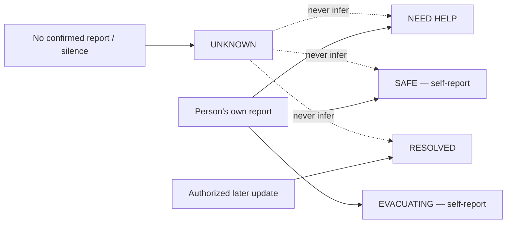

State updates are reports, not ground truth. The diagram shows state meanings, not a guarantee that every transition is accepted; validation and role rules in code govern updates.

A civilian cannot assign a team or impersonate a responder. An invalid packet cannot overwrite a valid `need_help`. Another origin cannot clear `need_help` to `safe`. Same-origin stale sequence does not downgrade. Unresolvable disagreement stays conflicting. Silence stays unknown.

Team desk statuses are `available`, `assigned`, `rescue_in_progress`, `partially_resolved`, `resolved`, and `handoff_requested`. There is no `rescued` status. Assignment is an audit row, not a rescue.

## Dynamic emergency groups

A group is an operational cluster of reports, not a chat room and not “phones that saw each other.”

Auto-grouping uses GPS only. BLE RSSI is unread. Two reports cluster only when the incident type matches, timestamps are within 30 minutes, both accuracies are known and at most 100 m, and distance plus both accuracy radii is still within 150 m. High confidence requires both accuracies at or below 30 m. One bad or missing fix does not create a group. A split or merge is recorded as lineage and does not delete the underlying reports. Duplicate and contradiction hints are operator prompts, not automatic merges.

## Command center

React, TypeScript, Vite, Tailwind. Leaflet shows stored coordinates. Tiles are an online map, not a mesh coverage layer.

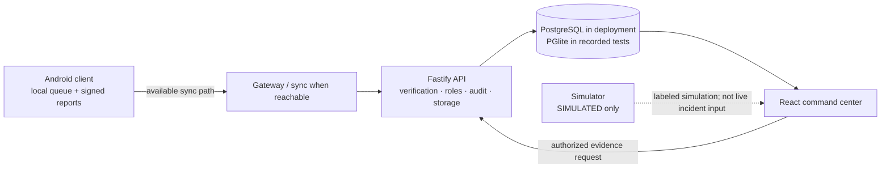

This is a logical architecture view, not evidence that a physical phone-to-gateway synchronization was exercised.

| Page | What it shows |
| --- | --- |
| Overview | Counts from stored rows. An empty database is zeros, not a census |
| Map | Incidents with coordinates. Missing location stays off the map |
| Inbox | Signed reports and delivery words |
| Groups | Conservative clusters and lineage |
| Teams | Named teams. Creating one is not a rescue |
| Connectivity | Contact observations. No coverage claim |
| Unknown zones | Cells with contact and no resolved state. Not a map of missing people |
| Alerts | No official warning is generated on the phone. SACHET is not connected |
| AI review | Extractor output, not persisted as an alert |
| Timeline / analytics | Stored events. Gateway delay is null when there is no sample |
| Simulator | Labeled `SIMULATED`. Does not insert a live incident |
| Edge | Witness cards, separate conflict counts, heard and unheard, hash-only evidence, gate decisions |
| Settings | Role-gated users and audit |

The laptop is a view and an operator channel. It is not required to capture, confirm, or queue.

## Simulator

`simulator/` runs logical nodes with a seeded PRNG. `radioKind` is always `SIMULATED`.

| Scenario | Logical nodes | What the test checks |
| --- | --- | --- |
| `baseline-10` | 10 | Result stays labeled simulated |
| `flood-100` | 100 | Loss and duplicates |
| `partition-1000` | 1,000 | Partition then reconnect, still simulated |
| `gateway-loss` | 40 | Gateway loss behavior in the model |
| `stress-10000` | 10,000 | Bounded run. Not device throughput |

Recorded simulator suite: 6 passed, 0 failed, including the 1,000-node and 10,000-node cases. That is a software model. It does not sign every packet the way the protocol tests do. It is not 10,000 phones, not BLE, and not a latency measurement.

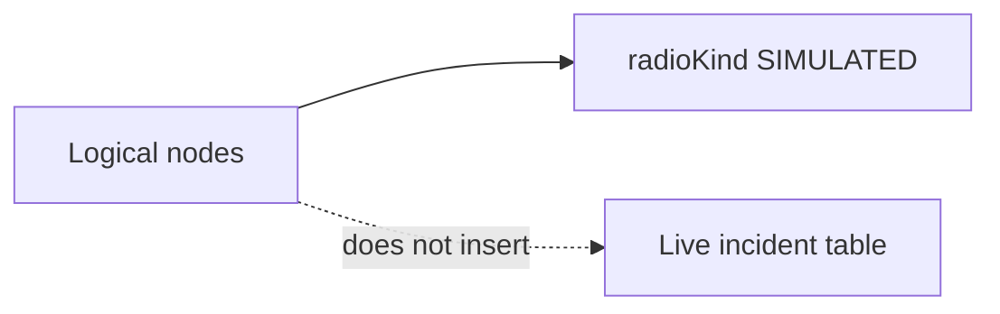

# Security & Trust Model

| Boundary | Mechanism |
| --- | --- |
| Origin | ECDSA P-256, SHA-256, Node `crypto` and Java `SHA256withECDSA`. No custom cipher |
| Phone key | Android Keystore preferred. Software fallback is labeled not hardware-backed |
| Relay | Can change hop fields only. Signed body failure rejects the packet |
| Replay | Unique `messageId` at the desk. Dedup cache on the forward path |
| Expiry | Future skew 2 minutes. TTL cap 48 hours. Expired packets are not forwarded |
| Simulation | `simulated` flag cannot enter live sync |
| Roles | Admin, operator, responder, alert publisher. Login failure does not reveal whether the account exists |
| Evidence | SHA-256. Operator-only explicit request. Clipboard cannot carry a command |
| Privacy of ids | 16-byte origin pseudonym. Heard-cut rejects phone numbers |

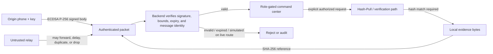

This is not military-grade and not unbreakable. A stolen unlocked phone can sign as that phone. A malicious relay can drop packets. Dropping is not the same as forging.

Threat notes: [docs/THREAT_MODEL.md](docs/THREAT_MODEL.md).

## Privacy

- Raw audio and images stay on the phone unless the user shares them.
- The mesh payload carries a hash and a short confirmed text, capped in the witness record.
- Location is optional, with accuracy, and is not inferred from RSSI.
- Heard-cut stores pseudonyms, not device names.
- Evidence retrieval is an audited operator action.
- There is no cloud model on the emergency path.
- Local demo HTTP and PGlite are not a production deployment. Use TLS and PostgreSQL before any shared network.

# Testing & Verification

Recorded in this environment on **2026-09-30**. `npm test` reported 0 failures. Android `:protocol:test` reported 0 failures. `:app:assembleDebug` exited 0. Those commands were **not rerun after the last source restore**. Current files contain the same declared test counts as that recorded run.

| Component | Declared tests now | Recorded result | Status |
| --- | --- | --- | --- |
| Protocol, including edge | 15 in `protocol.test.ts`, 6 in `edge.test.ts` | 21 passed | Software, that run |
| Backend API and edge | 6 + 2 | 8 passed, PGlite | Software, that run. PostgreSQL not started |
| Simulator | 6 | 6 passed, including 1,000 and 10,000 logical nodes | **SIMULATED** |
| Command center | 2 overview + 1 edge | 3 passed | Component tests, not a phone |
| Android JVM | `DmspTest` 6, `EdgeTest` 4 | 10 passed | JVM, not a device |
| Debug APK | `:app:assembleDebug` exit 0 | Recorded 11,031,792 bytes, SHA-256 `fbc6f0cd6a2d3246c06607efd2fd40db4d6ccf4cf3f62d80f4c188de927395cd` | Compile only. **Not installed.** Those bytes are **not in this tree** |

`docs/IMPLEMENTATION_STATUS.md` and `docs/UPGRADE_REPORT.md` cite a different SHA-256, `0d8ce23f…`, for the same recorded size. Do not treat that hash as the compile above. A later 11,015,408-byte archive (`51004911…`) also failed the recorded hash and is not the tested APK.

GitHub Actions workflows exist (`.github/workflows/ci.yml`, `.github/workflows/android-apk.yml`). This README does not claim they have gone green on GitHub.

### Physical validation

| Test | Status |
| --- | --- |
| APK install | **UNVERIFIED** |
| Camera, microphone, IMU, GPS, speech | **UNVERIFIED** |
| NPU inference | **UNAVAILABLE** / not loaded |
| BLE advertise, scan, connect, GATT write | **UNVERIFIED** |
| Two-phone signed exchange | **NOT RUN** |
| Three-phone A→B→C with B relaying | **PHYSICAL MULTI-HOP: UNVERIFIED** |
| Bluetooth interruption and recovery | **NOT RUN** |
| Wi-Fi Direct transfer | **UNVERIFIED** |
| Wi-Fi Aware transfer | Probe only. **UNVERIFIED** |
| Office Kit mirror, clipboard, file transfer, remote control | **UNAVAILABLE** in this tree |
| Share-sheet transfer | Code present. **UNVERIFIED** |

No latency, packet-success rate, radio fragment count, battery drain, or transfer time was measured. Do not fill `tests/physical-results.template.json` from the simulator.

# Data & Model Provenance

No project-specific model training is currently included in the repository. There is no dataset, no train/validation/test split, no weights file, and no accuracy number.

| Piece | What it is |
| --- | --- |
| Extractor | Hand-written rules. English, Hindi, Marathi word lists. Not trained |
| Witness draft | Same extractor, plus waterline words and a confirmation gate |
| Speech | Platform `SpeechRecognizer` if the device has one. Not bundled |
| Vision | Not included |
| NPU delegate | Not included. Status probe only |
| Simulator | Seeded logical nodes. Not field data |

# Performance & Scale

Only numbers that exist in code or in a recorded run:

| Figure | Where it comes from | Not |
| --- | --- | --- |
| 512-byte payload, 1400-byte packet, 160-byte chunks, 13-byte fragment header | Protocol constants | Measured airtime |
| 120-character mesh text | Protocol constant | A UX study |
| 8-second reassembly timeout | `Reassembler` default | A radio measurement |
| 150 m grouping rule, 100 m accuracy cap, 30-minute window | Grouping policy | A field accuracy study |
| 10, 100, 1,000, 10,000 logical nodes | Simulator scenarios and tests | Physical phones |
| 11,031,792-byte debug APK | Recorded compile, hash above | An installed or shipped binary in this tree |

No inference latency, backend latency, or message-throughput number is published because none was measured.

# Recommended 4–5 Minute Demo

Say this first: prototype, not a certified emergency service, no rescue guaranteed, **PHYSICAL MULTI-HOP: UNVERIFIED**.

| Time | Step | Label |
| --- | --- | --- |
| 0:00–0:40 | Sign in to the desk. Open Edge. Read empty counts and `UNHEARD ≠ SAFE`. Point at `MODEL_UNAVAILABLE` and Office Kit `UNAVAILABLE` | **SOFTWARE VERIFIED** for an empty seeded API. Zeros are stored rows |
| 0:40–1:30 | On a phone with a matching APK, open Witness. If a sensor fails, read the unavailable line and type `बाढ़ में तीन लोग फंसे हैं, पानी दरवाजे तक`. Make a draft. Do not confirm yet | Phone sensors **UNVERIFIED**. The sentence is a software extractor fixture |
| 1:30–2:20 | Confirm. The line must say queued offline, not delivered. Confirm the same sentence again: `defer` / `no_new_fact`. Change water to chest level: admit or replace. Do not defer a life threat | Gate rules **SOFTWARE VERIFIED**. Phone UI **UNVERIFIED** |
| 2:20–3:10 | Heard-cut only if a second phone has exchanged a verified packet. Otherwise stop and say the cut was not physically shown | Classification rule **SOFTWARE VERIFIED**. Radio **UNVERIFIED** |
| 3:10–4:00 | After a signed witness sync, show the hash and the absence of image bytes. Request original. Paste the wrong text: `corrupt_evidence` | API path **SOFTWARE VERIFIED**. A mesh pull must fail |
| 4:00–4:40 | Close on the sentence, the slot, and the cut. The simulator is not the radio. Three phones have not shown A to B to C | **SIMULATED** stays on the simulator page |

Do not play a success animation. Do not say “delivered to rescuer” unless the delivery word is `received_by_command_center` or `acknowledged_by_operator`, and even then say what those words actually mean.

# Known Limitations

- Physical multi-hop, BLE, Wi-Fi Direct, and Wi-Fi Aware transfer are unverified. Compiling a GATT writer is not a radio test.
- The on-device multi-chunk writer is explicitly not claimed. Packets over 180 bytes are not sent as one write and are not marked relayed.
- No NPU model is loaded. Office Kit is unavailable.
- The recorded APK bytes are not in this tree. The app was not installed here.
- `docs/PACKET_FORMAT.md` mentions a CRC trailer that `fragment.ts` does not write.
- Docker Compose / PostgreSQL was not started. Backend tests used PGlite.
- The scale simulator is not a signed-packet mesh and not a phone throughput test.
- OEM battery managers can kill scans. That was not measured.
- Some mesh errors are English even when the UI is Hindi or Marathi.
- Responder navigation opens an installed map app. This app does not draw the route.
- JWT in the demo is a bearer token. Local HTTP is a lab choice.
- This pre-event tree must not be submitted as in-event original work unless organisers permit it.

## Reproduce

Node.js 20 or newer. Android builds need JDK 17 and Android SDK 35.

```bash
cp .env.example .env
npm ci
export DM_PGLITE_PATH="$PWD/data/pglite"
SEED_USE_DEV_DEFAULTS=1 DM_DEV=1 DM_ALLOW_PGLITE=1 npm run seed
DM_DEV=1 DM_ALLOW_PGLITE=1 npm run dev:api
npm run dev:web
```

Desk: `http://127.0.0.1:5173`. Use the same `DM_PGLITE_PATH` for seed and API. Without it, PGlite is in-memory and the seed process does not reach the server.

Local demo accounts exist only if `SEED_USE_DEV_DEFAULTS=1`. They are not for a shared network:

- `admin@example.invalid` / `dev-admin-pass`
- `operator@example.invalid` / `dev-operator-pass`
- `responder@example.invalid` / `dev-responder-pass`
- `publisher@example.invalid` / `dev-publisher-pass`

Tests and simulator:

```bash
npm test
npm run simulate -- list
npm run simulate -- run --scenario baseline-10 --seed 42 --out /tmp/baseline.json
```

The JSON says `radioKind: SIMULATED`.

Android, the command that exited 0 in the authoring environment:

```bash
cd android
export JAVA_HOME=/path/to/jdk-17
export ANDROID_HOME=/path/to/android-sdk
# This snapshot has android/gradlew but not android/gradle/wrapper/gradle-wrapper.jar.
# The recorded run used Gradle 8.9 directly:
gradle :protocol:test :app:assembleDebug
```

Debug output, after a successful build: `android/app/build/outputs/apk/debug/app-debug.apk`. Installing it was not done here:

```bash
adb install -r android/app/build/outputs/apk/debug/app-debug.apk
```

Then follow [docs/PHYSICAL_DEVICE_TEST_PLAN.md](docs/PHYSICAL_DEVICE_TEST_PLAN.md). Leave every line `NOT RUN` until someone watches it.

PostgreSQL path, untested in the build environment: [docker-compose.yml](docker-compose.yml).

## Layout

```text
android/            Kotlin app, Compose UI, GATT and Wi-Fi Direct adapters, JVM protocol
shared-protocol/    DMSP/1 codec, edge rules, grouping, extractor, fragments
backend/            Fastify API, PostgreSQL or local PGlite, edge evidence routes
command-center/     React desk, including /edge
simulator/          Logical nodes, always SIMULATED
docs/               Format, threat model, device plan, edge report, compliance
scripts/            setup.sh, package.sh
tests/              Physical-result template. Not filled from the simulator
artifacts/          Intended APK drop. The recorded APK bytes are not in this snapshot
```

## Roadmap

| State | Item |
| --- | --- |
| In this tree | DMSP/1, phone UI, outbox, edge draft/gate/heard/hash, desk, simulator, software tests |
| Not finished as a device proof | Install the matching APK. Run camera, mic, IMU, GPS, speech on an iQOO 15 |
| Physical validation remaining | Two-phone signed exchange. Three-phone A→B→C with B as the only relay. BLE interruption and recovery |
| Not started | Office Kit SDK. A local model that actually loads. NPU delegate. CRC trailer if the packet doc is to match the code |
| Out of scope until organisers say otherwise | Submitting this pre-event tree as in-event original work |

## Official references

- [iQOO Hackathon 2026 guide and rules](https://iqoo.reskilll.com/guide) — weights, Red Light / Green Light, Office Kit, original-work rule
- [iQOO Hackathon terms](https://iqoo.reskilll.com/terms)
- [Registration](https://iqoo.reskilll.com/)
- [iQOO 15, India store](https://shop.iqoo.com/in/product/2067) — chip, camera, battery, OriginOS as published by iQOO
- [iQOO 15 product page](https://www.iqoo.com/en/products/iQOO-15)

## License

Apache-2.0. Third-party components are listed in `NOTICE`. Bluetooth Mesh, Wi-Fi Direct, Wi-Fi Aware, and Nearby are platform technologies. This project does not claim a Bluetooth SIG assignment or a government alert integration.
